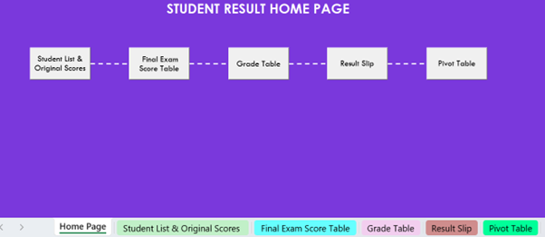
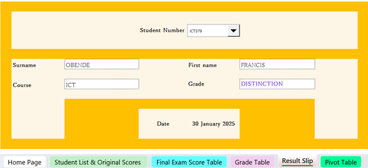
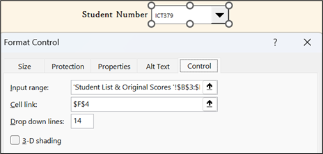
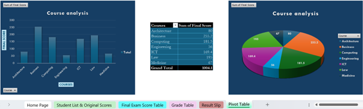
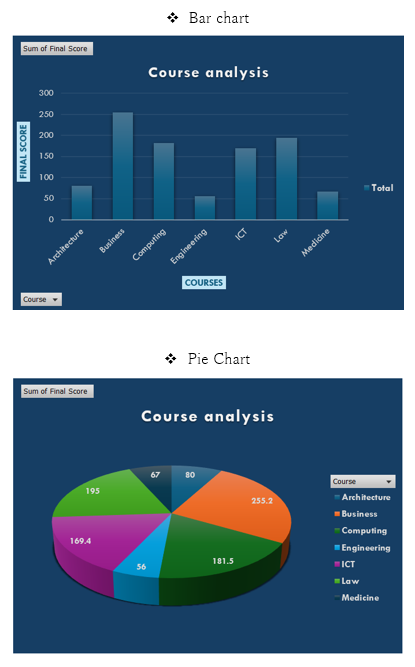

# Excel-data-analysis-automation
Excel data analysis and automation project demonstrating advanced formulas, data analysis, PivotTables, visualisation, macros and data validation.

# Excel Data Analysis & Automation

## Overview

This project demonstrates the use of Microsoft Excel for data analysis, automation, data validation and visualisation.

The project was developed around a student results scenario requiring the creation of an interactive spreadsheet system for managing student information, calculating examination results and analysing course data.

## Problem

The spreadsheet needed to provide an efficient way to:

- Calculate student examination results and additional marks
- Automatically determine final grades
- Retrieve individual student information
- Analyse student and course data
- Present information through charts and visualisations
- Validate and organise data
- Provide an easy-to-use interface

## Solution

I developed an interactive Excel workbook using formulas, lookup functions, data validation, PivotTables, charts, conditional formatting and macros.

The solution automatically calculates results and grades, retrieves student information based on a selected student number, analyses course data and presents the results through visualisations.

## Technologies & Features

- Microsoft Excel
- Advanced formulas and functions
- IF functions
- VLOOKUP / XLOOKUP
- Conditional formatting
- Data validation
- Advanced sorting and filtering
- PivotTables
- Charts and data visualisation
- Slicers
- Macros
- Data cleaning
- Predictive analysis
- Data interpretation

## Key Features

### Automated Results Calculation

Used formulas and conditional formatting to calculate examination scores, additional marks, total marks and grades.

### Student Result Lookup

Created an interactive result slip where a student number can be selected from a drop-down list and the corresponding student information is automatically displayed.

### Data Analysis

Used PivotTables to analyse course data and created charts to communicate the results visually.

### Data Management

Applied sorting, filtering, data validation and conditional formatting to improve data accuracy and usability.

### Automation

Used Excel macros to create navigation between different sections of the workbook and support user interaction.

## Screenshots

### Dashboard

### Student Results

### Student Result Lookup

### PivotTable Analysis

### Data Visualisation

## What I Learned

This project strengthened my ability to use Excel for data analysis and decision-making rather than simply storing information.

I developed practical experience combining formulas, lookup functions, data validation, PivotTables and visualisation to create an interactive data solution.

I also gained experience automating spreadsheet processes using macros and presenting information in a clear and user-friendly format.
